# Lotus Yoga

[Visit the live website here!](https://shieldsjohn.github.io/Lotus_Yoga/index.html)

Lotus Yoga is a website which is a resource for anyone interested in or currently practising yoga.  The site aims to explain what yoga is, share the benefits of yoga and provide a collection of videos for beginner, intermediate and advanced users.  Lotus Yoga also encourages signing up to our newsletter which will motivate users to continue their yoga journey.

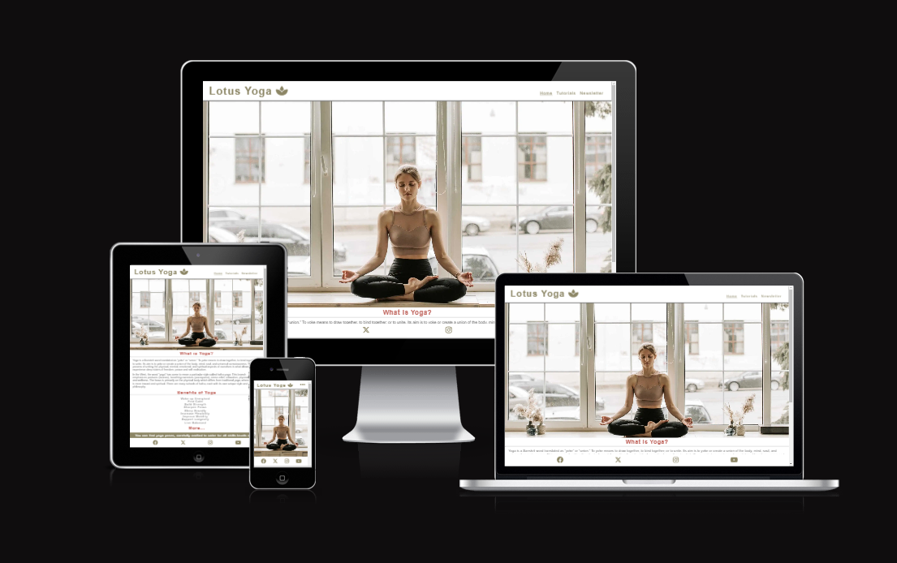

## User Experience (UX)

###	User Stories
o	First Time Visitor Goals
-	To quickly understand and find the information I am looking for.
-	To intuitively navigate the website and interact with the content.
-	To learn more about yoga and its benefits.

o	Returning Visitor Goals
-	To find the content engaging and updated.
-	To have enjoyed the first attempt of the tutorials to return for more.
-	To find and interact with Lotus Yoga via social media channels.

o	Frequent User Goals
-	To practice the tutorials provided and progress through the levels.
-	To find new tutorials added regularly.
-	To subscribe to the newsletter for more information on yoga and website updates.

###	Design
o	Colour Scheme
-	I took inspiration form the colours in the photos and videos I found for the website.  Those being the light, natural, earthy tones against a clean white background, to evoke a feeling of calm.
-	The main colour used throughout is Clay Creek which I feel complements the wooden tones in the images, whilst still providing enough contrast against the white backgrounds, for accessibility.

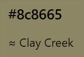

- For some headings, banners and text elements I also used Contessa which I took from the model’s leggings that she wears in some of the videos.  To do this, I used www.imagecolorpicker.com 

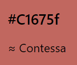

###	Imagery
-	I sourced all photos and videos from the following user account on Pexels www.pexels.com/@vlada-karpovich/ as I felt these had the clean consistent feel I was looking for.
-	The hero image of the model demonstrating the Lotus position, inspired the website name and logo.  I feel this image sets the tone for the website.
-	The other image used, on the Newsletter page was again chosen for its calm aesthetic but also its aspirational quality for visitors who may be beginners, encouraging them to sign up for the newsletter.
-	The videos are short and concise and all in landscape orientation which along with the images, provide consistency through responsive design.

###	Typography
-	I have chosen Lato from Google Fonts for the majority of page text and changed the colour from Clay Creek to Mine Shaft - I did this to improve accessibility.  However, I have left the header, menu and some headings in Clay Creek to maintain the style of the pages.

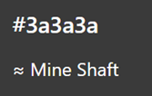

-	I have kept fonts to only Lato and Sans-Serif to keep the typography simple and consistent.
-	In terms of alignment on the Tutorials page, on smaller devices the text is left-aligned to ease reading.  On larger devices, the text moves to centre-aligned, this is a creative decision to keep everything centred and ‘balanced’ in keeping with the themes of yoga.  By doing this, space is created around the text, while the videos are set to fill the width of the viewport. 

### Features
o	Video Tutorials
-	There are nine videos in total, three for each level of Beginner, Intermediate and Advanced.  They are short demonstrations of yoga poses, along with text instructions to break down the sequential steps to successfully achieve the pose.  Each level category is hyperlinked to allow visitors to jump to the required level on the page.

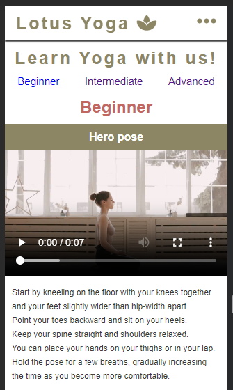

o	Mobile-first responsive design

- Creation of the site followed a mobile-first, responsive design approach.  With most internet traffic originating from mobile phones, the starting point was to ensure a smooth user experience on mobile phones.  Therefore, the videos, especially, had to be optimised for mobiles and responsive to make the most of the screen sizes offered by larger devices.  Other elements such as the navbar layout change depending on the viewport of the device used.

*Mobile dropdown navbar*

*Tablet navbar*

o	Future Features under consideration
-	Updated video content with verbal instructions.
-	Live video yoga sessions.
-	Article teasers to drive users to subscribe to the newsletter, where full articles will be found.
-	Podcast episodes.

## Technologies Used
o	Languages Used
-	HTML5
-	CSS3

##	Frameworks, Libraries & Programs Used
o	Google Fonts
-	Used to import the Lato font, which has been used throughout the site.

o	Font Awesome
-	Used to include the ‘Lotus’ icon in the header and social media icons in the footer of each page.

o	codeanywhere
-	Used as an IDE workspace to code the website.

o	Git
-	Used the Gitpod terminal in codeanywhere to push updates to Github to maintain version control.
o	Github
-	Used as a repository for code of the website.

o	Gitpages
-	Used to deploy the website.

## Code Testing
I used the W3C Markup Validator (for HMTL) and the W3C CSS Validator (for CSS) to validate each page of the website to ensure there were no syntax errors.  I corrected errors by the removal of duplicate instances of 'section', due to copy and pasting.  Final validation results below.

*HTML Home page*

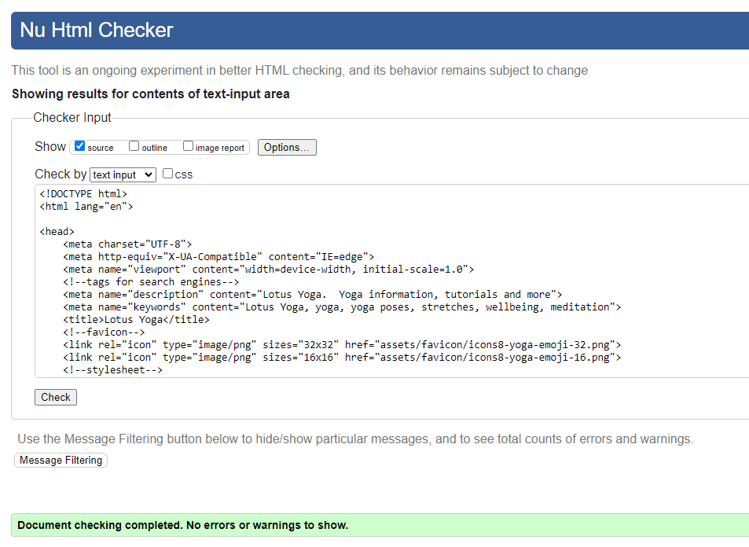

*HTML Tutorials page*

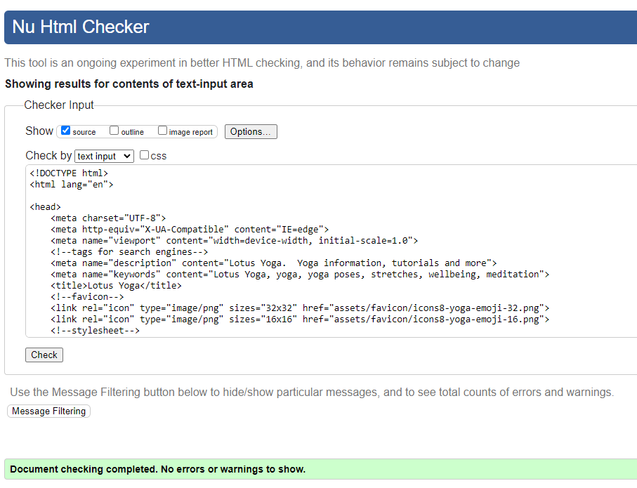

*HTML Newsletter page*

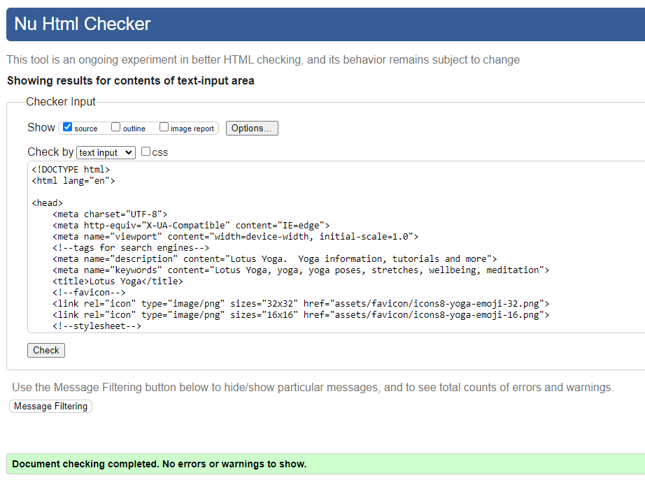

*CSS*

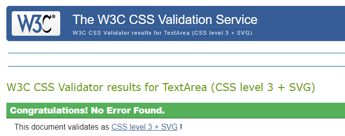

## Testing User Stories from User Experience (UX) Section
**First Time Visitor Goals**

o	To quickly understand and find the information I am looking for.
-	The title and the hero image tell the user what the site is all about and upon scrolling down, information is provided on what yoga is and the benefits of it.
-	Both the home page and navbar point the user in the direction of the other pages.  The section at the bottom of the home page also explains what the tutorials are.

o	To intuitively navigate the website and interact with the content.
-	The user is presented with a simple layout on arriving at the home page.  A customary navigation bar in the top right of the header shows the page options to select.
-	Further down the home page there are links to the Tutorials Page and also the Newsletter page.
-	The Tutorial page has hyperlinks to allow users to jump to each level, rather than scroll through all the videos on the page.
-	The navbar is always in reach as it’s fixed to the top of each page, allowing users to freely navigate the site.
-	Similarly, the social media links are in the footer of each page, allowing access from any page on the site.

o	To learn more about yoga and its benefits.
-	The home page addresses both of those needs with sections dedicated to them.
-	Video tutorials and step-by-step instructions show how the poses are done.
-	The user can sign up for a weekly newsletter which will provide more information on yoga.

**Returning Visitor Goals**

o	To find the content engaging and updated.
-	I chose to include video tutorials on the site, rather than image tutorials as videos are more engaging, better at communicating the instructions and help to keep users on the site longer.
-	The newsletter will serve to communicate website updates to users as well as provide yoga-related articles.

o	To have enjoyed the first attempt of the tutorials to return for more.
-	By providing a variety of videos, it is intended that users will return.

o	To find and interact with Lotus Yoga via social media channels.
-	Social media links are represented by their icons in the footer, which is always accessible on each page.
-	The links open in new tabs, so as to keep the user on our website until they decide to leave.

**Frequent Visitor Goals**

o	To practice the tutorials provided and progress through the levels.
-	By providing videos for each skill level, users especially those at Beginner and Intermediate levels, can return and practice the poses and progress to further levels.

o	To find new tutorials added regularly.
-	It is expected that users will return to practice the poses and at those future visits will see the new tutorials.
-	If the user does not visit regularly but they have subscribed to the newsletter they will be made aware of new tutorials via email.

o	To subscribe to the newsletter for more information on yoga and website updates.
-	A newsletter sign-up page can be found either by accessing the navbar or by the link at the bottom of the home page.
-	When the user arrives at the Newsletter page, an intuitive form can be completed.  This requests the user to provide First Name, Second Name and Email Address.  The form will ask the user to provide a correct email address if the information provided is incorrect or incomplete, for example if there is no ‘@’ or ‘.com’ etc.
-	The form also requests the user to state their skill level via radio buttons for Beginner, Intermediate and Advanced.
-	There is a ‘submit’ button which reads ‘Realign those Chakras’ and changes colour when hovered over.

## Website Testing

-	Responsiveness was tested on Chrome DevTools emulator, a HP laptop and my iPhone 8.
-	The navbar, all pages and links have been tested.
-	I ran Chrome DevTools Lighthouse on each page to check performance, accessibility, best practice and SEO.  I was concerned by the performance on the Tutorials page.  However, I checked this with Code Institute and their results are below.  It was pointed out that many factors including internet speed affect the result and Lighthouse is outside the scope of the syllabus.

**My results:**

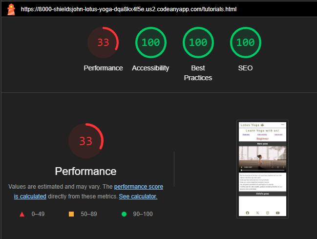

**Code Institute results:**

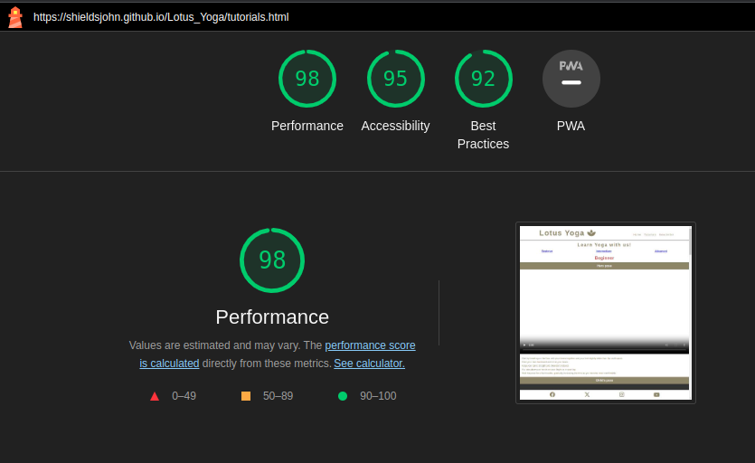

### Known Bugs

-	When testing on iPhone 8, the hero image length was too long and the form submit button on the newsletter was partially hidden by the footer.
-	I added additional media queries to ensure the site is responsive on iPhone 8.

## Deployment

o	This website was deployed with Github Pages per the below steps:
-	Log into Github and select the relevant repository.
-	Select ‘Settings’ from the menu along the top of the window.
-	Scroll down and select ‘Pages’ under the ‘Code and Automation’ section.
-	From the dropdown menu under ‘Source’, select ‘Deploy from a branch.’
-	Ensure the dropdown menu under 'Branch’ is set to ‘main’ and the folder dropdown menu next to it is set to '(root)’ and click ‘Save’.
-	The page will refresh.
-	Once refreshed, scroll down and click ‘github-pages’ on the right-hand side.
-	This will take you to the Deployments/History screen where you can click ‘View deployment’ to view the website.

## Credits

o	Code
-	All HTML and CSS code written by John Shields.
-	Stack Overflow was referred to for assistance with videos and scroll-padding, no code was copied.
-	The ‘Love Running’ project was also referred to, especially for assistance with the form.

o	Content
-	Excerpts of text for the ‘What is Yoga’ section on home page taken from www.yogabasics.com/learn/yoga-101-an-introduction/what-is-yoga/
-	Text for ‘Benefits of Yoga’ section taken from www.yogainternational.com
-	Text instructions for Tutorials page generated from ChatGPT for consistency.

o	Media
-	All photos and videos are from www.pexels.com/@vlada-karpovich/
-	Icons in the footer are from www.fontawesome.com

o	Acknowledgements
-	Lighthouse assistance from Code Institute tutor.
-	Continuous support from my mentor.
